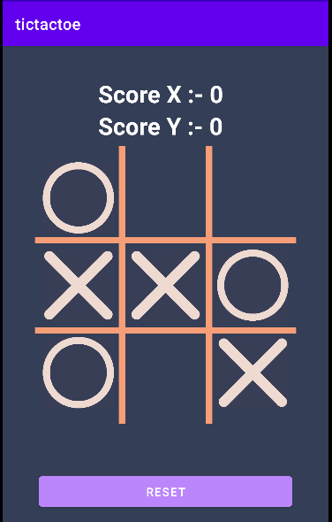

# tic-tac-toe-minimax
An implementation of Minimax AI Algorithm on Tic-Tac-Toe (or Noughts and Crosses) game.
<p align="center">
	</img>
</p>

## Introduction
Tic-Tac-Toe is a rather simply game with only 255,168 possible games that can be played. This number is trivial for today’s computers, that’s why Tic-Tac-Toe is considered to be a solved game which means the outcome can be predicted given any state. The game is so simple that we can generate the entire game tree without trouble, whereas in chess there are already 69,352,859,712,417 possible games that could’ve been played after just 10 moves.

## What is Minimax
Minimax is a type of adversarial search algorithm for generating and exploring game trees. It is mostly used to solve zero-sum games where one side’s gain is equivalent to other side’s loss, so adding all gains and subtracting all losses end up being zero.
Adversarial search differs from conventional searching algorithms by adding opponents into the mix. Minimax algorithm keeps playing the turns of both player and the opponent optimally to figure out the best possible move.

## How does it work?
Implementing minimax for Tic-Tac-Toe is simple. We will recursively generate the game tree by exploring all possible moves for each board state and upon reaching a terminal state, we will assign a value of 1 for winning, -1 for losing and 0 for draw. Then based on these terminal states, for each explored turn either maximizer or minimizer will pick the most appropriate move. Doing so will propagate these outcomes all the way up to the root of the tree.

## Understanding the Algorithm

```
function findBestMove(board):
    bestMove = NULL
    for each move in board :
        if current move is better than bestMove
            bestMove = current move
    return bestMove
end
```
**Minimax :**
To check whether or not the current move is better than the best move we take the help of minimax() function which will consider all the possible ways the game can go and returns the best value for that move, assuming the opponent also plays optimally 

The code for the maximizer and minimizer in the minimax() function is similar to **findBestMove()** , the only difference is, instead of returning a move, it will return a value. Here is the pseudocode :  

```
function minimax(board, depth, isMaximizingPlayer):

    if current board state is a terminal state :
        return value of the board
    
    if isMaximizingPlayer :
        bestVal = -INFINITY 
        for each move in board :
            value = minimax(board, depth+1, false)
            bestVal = max( bestVal, value) 
        return bestVal

    else :
        bestVal = +INFINITY 
        for each move in board :
            value = minimax(board, depth+1, true)
            bestVal = min( bestVal, value) 
        return bestVal 
end
```
**Checking for GameOver state :**
To check whether the game is over and to make sure there are no moves left we use isMovesLeft() function. It is a simple straightforward function which checks whether a move is available or not and returns true or false respectively. Pseudocode is as follows :
```
function isMovesLeft(board):
    for each cell in board:
        if current cell is empty:
            return true
    return false
end
```

**Making our AI smarter :**
One final step is to make our AI a little bit smarter. Even though the following AI plays perfectly, it might choose to make a move which will result in a slower victory or a faster loss. Lets take an example and explain it.
Assume that there are 2 possible ways for X to win the game from a give board state.

Move **A** : X can win in 2 move
Move **B** : X can win in 4 moves
Our evaluation function will return a value of +10 for both moves **A** and **B**. Even though the move **A** is better because it ensures a faster victory, our AI may choose **B** sometimes. To overcome this problem we subtract the depth value from the evaluated score. This means that in case of a victory it will choose a the victory which takes least number of moves and in case of a loss it will try to prolong the game and play as many moves as possible. So the new evaluated value will be

Move **A** will have a value of +10 – 2 = 8
Move **B** will have a value of +10 – 4 = 6
Now since move A has a higher score compared to move **B** our AI will choose move **A** over move **B**. The same thing must be applied to the minimizer. Instead of subtracting the depth we add the depth value as the minimizer always tries to get, as negative a value as possible. We can subtract the depth either inside the evaluation function or outside it. Anywhere is fine. I have chosen to do it outside the function. Pseudocode implementation is as follows. 
```
if maximizer has won:
    return WIN_SCORE – depth

else if minimizer has won:
    return LOOSE_SCORE + depth
end
```

## Game Tree
<p align="center">
	</img>
</p>
**Explaination:**
This image depicts all the possible paths that the game can take from the root board state. It is often called the Game Tree.
The 3 possible scenarios in the above example are :

Left Move : If X plays [2,0]. Then O will play [2,1] and win the game. The value of this move is -10
Middle Move : If X plays [2,1]. Then O will play [2,2] which draws the game. The value of this move is 0
Right Move : If X plays [2,2]. Then he will win the game. The value of this move is +10;

In a more complex game, such as chess, it's hard to search whole game tree. However, **Alpha–beta Pruning** is an optimization method to the minimax algorithm that allows us to disregard some branches in the search tree, because he cuts irrelevant nodes (subtrees) in search. For more information, see:

* Book: George T. Heineman; Gary Pollice; Stanley Selkow. Algorithms in a nutshell. O'Reilly, 2009.
* Wikipédia: <https://en.wikipedia.org/wiki/Minimax>
* Nanyang Technological University: <https://www.ntu.edu.sg/home/ehchua/programming/java/JavaGame_TicTacToe_AI.html>
* GFG
* https://levelup.gitconnected.com/mastering-tic-tac-toe-with-minimax-algorithm-3394d65fa88f
